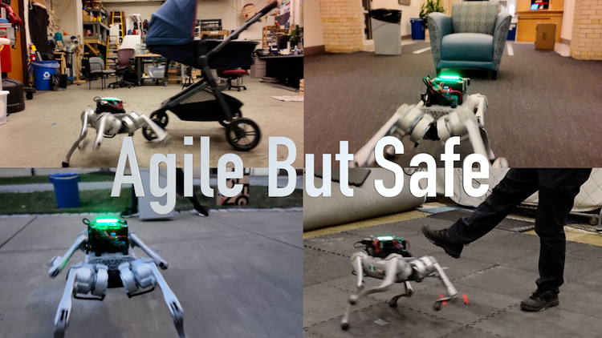
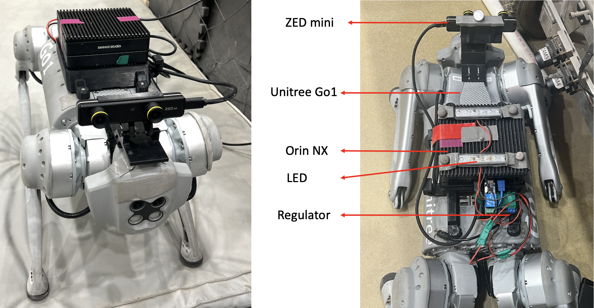

# ABS

Official Implementation for [Agile But Safe: Learning Collision-Free High-Speed Legged Locomotion](https://agile-but-safe.github.io/).

[Tairan He*](https://tairanhe.com/), [Chong Zhang*](https://zita-ch.github.io/), [Wenli Xiao](https://wenlixiao-cs.github.io/), [Guanqi He](https://guanqihe.github.io/), [Changliu Liu](https://www.cs.cmu.edu/~cliu6/), [Guanya Shi](https://www.gshi.me/)  

<p align="center">
  
</p>

This codebase is under [CC BY-NC 4.0 license](https://creativecommons.org/licenses/by-nc/4.0/deed.en), with inherited license in [Legged Gym](training/legged_gym) and [RSL RL](training/rsl_rl) from *ETH Zurich, Nikita Rudin* and *NVIDIA CORPORATION & AFFILIATES*. You may not use the material for commercial purposes, e.g., to make demos to advertise your commercial products.

Please read through the whole README.md before cloning the repo.

## Training in Simulation

### Pipeline to Install and Train ABS

**Note**: Before running our code, it's highly recommended to first play with [RSL's Legged Gym version](https://github.com/leggedrobotics/legged_gym) to get a basic understanding of the Isaac-LeggedGym-RslRL framework.
   <!-- <br/><br/> -->

1. Create environment and install torch

   ```text
   conda create -n xxx python=3.8  # or use virtual environment/docker
   
   pip3 install torch torchvision torchaudio --extra-index-url https://download.pytorch.org/whl/cu116  
   # used version during this work: torch==2.0.1 torchvision==0.15.2 torchaudio==2.0.2
   # for older cuda ver:
   pip3 install torch==1.10.0+cu113 torchvision==0.11.1+cu113 torchaudio==0.10.0+cu113 -f https://download.pytorch.org/whl/cu113/torch_stable.html
   ```

   

2. Install Isaac Gym preview 4 release https://developer.nvidia.com/isaac-gym

   unzip files to a folder, then install with pip:

   `cd isaacgym/python && pip install -e .`

   check it is correctly installed by playing: 

   ```cmd
   cd examples && python 1080_balls_of_solitude.py
   ```

   

3. Clone this codebase and install our `rsl_rl` in the training folder

   ```cmd
   pip install -e rsl_rl
   ```


4. Install our `legged_gym`

   ```cmd
   pip install -e legged_gym
   ```

   Ensure you have installed the following packages:
    + pip install numpy==1.20 (must < 1.24)
    + pip install tensorboard
    + pip install setuptools==59.5.0

5. Try training.

   can use "--headless" to disable gui, press "v" to pause/resume gui play.

   for go1, in `legged_gym/legged_gym`,
    ```text
   # agile policy
   python scripts/train.py --task=go1_pos_rough --max_iterations=4000 
   
   # agile policy, lagrangian ver
   python scripts/train.py --task=go1_pos_rough_ppo_lagrangian --max_iterations=4000
   
   # recovery policy
   python scripts/train.py --task=go1_rec_rough --max_iterations=1000
   ```

   
6. Play the trained policy

   ```cmd
   python scripts/play.py --task=go1_pos_rough
   python scripts/play.py --task=go1_rec_rough
   ```

7. Use the testbed, and train/test Reach-Avoid network:

   ```text
   # try testbed
   python scripts/testbed.py --task=go1_pos_rough [--load_run=xxx] --num_envs=1

   # train RA (be patient it will take time to converge) 
   # make sure you have at least exported one policy by play.py so the exported folder exists
   python scripts/testbed.py --task=go1_pos_rough --num_envs=1000 --headless --trainRA
   
   # test RA (only when you have trained one RA)
   python scripts/testbed.py --task=go1_pos_rough --num_envs=1 --testRA
   
   # evaluate
   python scripts/testbed.py --task=go1_pos_rough --num_envs=1000 --headless [--load_run=xxx] [--testRA]
   ```

8. Sample dataset for ray-prediction network training
   ```cmd
   python scripts/camrec.py --task=go1_pos_rough --num_envs=3
   ```
   + Tips 1: You can edit the `shift` value in Line 93 and the `log_root` in Line 87 to collect different dataset files in parallel (so you can merge them by simply moving the files), and manually change the obstacles in `env_cfg.asset.object_files` in Line 63.
   + Tips 2: After collecting the data, there's a template code in [`train_depth_resnet.py`](training/legged_gym/legged_gym/scripts/train_depth_resnet.py) to train the ray-prediction network, but using what you like for training CV models is highly encouraged!
   + Tips 3: You may change camera configs of resolution, position, FOV, and depth range in the [config file](training/legged_gym/legged_gym/envs/go1/go1_pos_config.py) Line 151.


## Hardware Deployment 
### System Overview
<p align="center">
  
</p>

- **Robot**: [Unitree Go1 EDU](https://shop.unitree.com/)
- **Perception**: [ZED mini Camera](https://store.stereolabs.com/products/zed-mini)
- **Onboard Compute**: [Orin NX (16GB)](https://www.seeedstudio.com/reComputer-J4012-p-5586.html)
- **LED**: [PSEQT LED Lights](https://www.amazon.com/gp/product/B0BKGF3JMG/ref=ox_sc_act_title_1?smid=A1QWPB2EZDWX2O&th=1)
- **Power Regulator**: [Pololu 12V, 15A Step-Down Voltage Regulator D24V150F12](https://www.pololu.com/product/2885)

### 3D Print Mounts
- Orin NX mount: [STL-PCMount_v2](deployment/3dprints/PCMount_v2.STL)
- ZED mini mount: [STL-CameraSeat](deployment/3dprints/CameraSeat.STL) and [STL-ZEDMountv1](deployment/3dprints/ZEDMountv1.STL)

### Deployment Code Installation
- [Unitree Go1 SDK](https://github.com/unitreerobotics/unitree_legged_sdk)
- [ZED SDK](https://www.stereolabs.com/developers/release)
- [ROS Noetic](https://wiki.ros.org/noetic/Installation/Ubuntu)
- Pytorch on a Python 3 environment

### Deployment Setup
- Low Level Control Mode for Unitree Go1: `L2+A` -> `L2+B` -> `L1+L2+Start`
- Network Configuration for Orin NX: 
  - **IP**: `192.168.123.15`
  - **Netmask**: `255.255.255.0`
- Convert the `.pt` files of agile/recovery policy, RA value to `.onnx` files using `src/abs_src/onnx_model_converter.py`

- Modify the path of (.onnx or .pt) models in `publisher_depthimg_linvel.py` and `depth_obstacle_depth_goal_ros.py`

### Deployment Scripts
1. `roscore`: Activate ROS Noetic Envrioment
2. `cd src/abs_src/`: Enter the ABS scripts file
3. `python publisher_depthimg_linvel.py`: Publish ray prediction results and odometry results for navigation goals
4. `python led_control_ros.py`: Control the two LED lights based on RA values
5. `python depth_obstacle_depth_goal_ros.py`: Activate the Go1 using the agile policy and the recovery policy

### Deployment Controllers
- `B`: Emergence stop
- `Default`: Go1 Running ABS based on goal command
- `L2`: Turn left
- `R2`: Turn right
- `Down`: Back
- `Up`: Stand
- `A`: Turn around
- `X`: Back to initial position


## Troubleshooting:
### Contact
+ Deployment and Ray-Prediction: Tairan He, tairanh@andrew.cmu.edu
+ Policy Learning in Sim: Chong Zhang, chozhang@ethz.ch
+ PPO-Lagrangian Implementation: Wenli Xiao, randyxiao64@gmail.com

### Issues
You can create an issue if you meet any bugs, except:
+ If you cannot run the [vanilla RSL's Legged Gym](https://github.com/leggedrobotics/legged_gym), it is expected that you first go to the vanilla Legged Gym repo for help.
+ There can be CUDA-related errors when there are too many parallel environments on certain PC+GPU+driver combination: we cannot solve thiss, you can try to reduce num_envs.
+ Our codebase is only for our hardware system showcased above. We are happy to make it serve as a reference for the community, but we won't tune it for your own robots.

## Credit
If our work does help you, please consider citing us and the following works:
```bibtex
@inproceedings{AgileButSafe,
  author    = {He, Tairan and Zhang, Chong and Xiao, Wenli and He, Guanqi and Liu, Changliu and Shi, Guanya},
  title     = {Agile But Safe: Learning Collision-Free High-Speed Legged Locomotion},
  booktitle = {arXiv},
  year      = {2024},
}
```
We used codes in [Legged Gym](training/legged_gym) and [RSL RL](training/rsl_rl), based on the paper:
  + Rudin, Nikita, et al. "Learning to walk in minutes using massively parallel deep reinforcement learning." CoRL 2022.

Previsou works that heavily inspired the policy training designs:
 + Rudin, Nikita, et al. "Advanced skills by learning locomotion and local navigation end-to-end." 2022 IEEE/RSJ International Conference on Intelligent Robots and Systems (IROS). IEEE, 2022.
 + Zhang, Chong, et al. "Learning Agile Locomotion on Risky Terrains." arXiv preprint arXiv:2311.10484 (2023).
 + Zhang, Chong, et al. "Resilient Legged Local Navigation: Learning to Traverse with Compromised Perception End-to-End." ICRA 2024.

Previsou works that heavily inspired the RA value design:
+ Hsu, Kai-Chieh, et al. "Safety and liveness guarantees through reach-avoid reinforcement learning." RSS 2021.

Previsou works that heavily inspired the perception design:
+ Hoeller, David, et al. "Anymal parkour: Learning agile navigation for quadrupedal robots." Science Robotics 9.88 (2024): eadi7566.
+ Acero, F., K. Yuan, and Z. Li. "Learning Perceptual Locomotion on Uneven Terrains using Sparse Visual Observations." IEEE Robotics and Automation Letters 7.4 (2022): 8611-8618.

